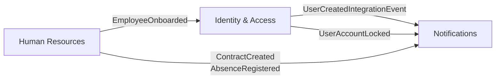

| Término| Definición| Ejemplo|
|--------|---------|---------|
| .......| ........| ........|
|Employee|Persona con relación laboral formal|Juan Pérez (Legajo 45823)|

Característica|Identity Access (IAM)|Human Resources (HR)
|--------|---------|---------|
Identificador|User_ID (UUID/String)|Employee_ID (Legajo/ID Interno)
Dato clave|Password / Email de login|Salario / Fecha de nacimiento
Cambios|Cambia poco (seguridad)|"Cambia seguido (ascensos, sueldos)"
Frecuencia|Se consulta en cada petición al API|Se consulta para procesos de negocio

Atributo|Contexto: Identity-Access|Contexto: Human-Resources
|--------|---------|---------|
Responsabilidad|Autenticación, Seguridad, Sesiones.|Contratos, Nómina, Desempeño.
Entidad Principal|User|Employee
Atributos Clave|Username, HashedPassword, Roles.|Salary, HireDate, Department.
Identificador|account_id (UUID)|employee_number (Legajo)
Lenguaje Ubicuo|Login, Token, Grant, Claim.|Onboarding, Vacaciones, Ascenso.

---------------
#  Notifications

**Bounded Context:** Gestión de comunicaciones salientes.

---

## 📖 1. Lenguaje Ubicuo
* **Notification (Notificación):** La unidad de mensaje enviada (un email, un SMS).
* **Template (Plantilla):** El cuerpo predefinido del mensaje con variables dinámicas (ej: "Hola {{name}}").
* **Recipient (Destinatario):** El contacto al que se envía el mensaje (Email, ID de usuario).
* **Provider (Proveedor):** El servicio externo que entrega el mensaje (SendGrid, AWS SES, Twilio).

## 🏗️ 2. Diseño Táctico
* **`Notification` (Aggregate Root):**
  * ID, Recipient, TemplateID, Data (JSON con las variables), Status (Pending, Sent, Failed).
* **`Channel` (Value Object):** Define si es EMAIL, SMS o PUSH.

## ⚙️ 3. Reglas de Negocio
1. Toda notificación debe estar asociada a una `Template` existente.
2. Si un envío falla por culpa del proveedor, el sistema debe reintentar hasta 3 veces (Retry Policy).
3. Se debe guardar un log de "Visto/Abierto" si el canal lo permite.
[back](./readme.md)

## Módulos Actuales

1. Identity & Access (IAM)

Encargado de la identidad técnica y el control de acceso.

* Entidades Clave: User, Role, Permission.

* Responsabilidades: Autenticación (JWT), Gestión de RBAC (Role-Based Access Control) y Auditoría de accesos.

2. Human Resources (HR)

Encargado del empleado como entidad de negocio y su relación laboral.

* Entidades Clave: Employee, Contract, Department.

* Responsabilidades: Onboarding de personal, gestión de contratos, organigrama y ausencias.

🗺️ Mapa de Contextos (Context Map)

Para mantener la integridad del sistema, los módulos se comunican mediante eventos.

Ejemplo de flujo de integración:

* HR registra un nuevo Employee.

* Se dispara un evento de dominio EmployeeOnboarded.

* IAM reacciona a este evento creando un User con los permisos base.

Flujo típico de onboarding:

HR registra un nuevo Employee
Se publica EmployeeOnboarded
IAM crea el User y envía UserCreatedIntegrationEvent
Notifications envía el correo de bienvenida con token de activación

# Modelo de Dominio: Identity & Access (IAM)

**Bounded Context:** Gestión de Identidad y Accesos.
**Responsabilidad:** Proteger el ecosistema del ERP, garantizando que solo los usuarios autenticados y autorizados puedan interactuar con los recursos del sistema.

---

## 📖 1. Lenguaje Ubicuo (Glosario)
Términos estrictos que todo el equipo debe usar al referirse a este módulo:

* **User (Usuario):** Un actor técnico (persona o sistema) que tiene credenciales para acceder al ERP. *Nota: No confundir con "Empleado".*
* **Role (Rol):** Una agrupación lógica de permisos (Ej. `Admin`, `HR_Manager`, `Viewer`).
* **Permission / Claim (Permiso):** El derecho específico para ejecutar una acción (Ej. `employees:write`).
* **Credentials (Credenciales):** El conjunto de datos (Email y Contraseña) que un Usuario presenta para demostrar su identidad.
* **Token:** Artefacto de seguridad (JWT) que representa una sesión activa y contiene las Claims del usuario.

---

## 🏗️ 2. Diseño Táctico (Tactical DDD)

### Agregados y Raíz de Agregado (Aggregate Root)
* **`User` (Aggregate Root):** Es la entidad principal. Toda modificación sobre sus roles o credenciales debe pasar por esta entidad para garantizar la consistencia.

### Entidades (Entities)
Tienen identidad única y su estado puede cambiar con el tiempo.
* **`Role`:** * Identificador: `Role_ID`
  * Atributos: `Name`, `Description`, `Permissions` (Lista).

### Objetos de Valor (Value Objects)
No tienen identidad propia, son inmutables y se definen por sus atributos. Si un atributo cambia, es un objeto completamente nuevo.
* **`EmailAddress`:** Encapsula la validación del formato del correo electrónico. No es solo un `string`.
* **`PasswordHash`:** Representa la contraseña ya cifrada. Nunca debe almacenar la contraseña en texto plano.
* **`TokenValue`:** Encapsula la lógica de los tokens JWT y su fecha de expiración.

---

## ⚙️ 3. Reglas de Negocio (Invariantes del Dominio)
Las reglas que el Agregado `User` debe proteger en todo momento:
1. Un `User` no puede existir sin un `EmailAddress` válido y único.
2. Un `User` recién creado debe estar en estado "Pendiente de Activación" hasta que verifique su correo.
3. Un `User` debe tener al menos un `Role` asignado para poder generar un `Token` válido.
4. Las contraseñas (`PasswordHash`) deben cumplir con políticas de complejidad antes de ser aceptadas.

-----------

Resumen de los beneficios obtenidos con estos cambios en tu documentación:

    No perderás eventos: Gracias al Transactional Outbox.

    No enviarás correos dobles: Gracias a la Idempotencia.

    No saturarás hilos en caídas externas: Gracias al Circuit Breaker.

    Tus HR Managers no chocarán al editar: Gracias al Optimistic Locking.

    Tu base de datos escalará mejor: Gracias a CQRS Ligero.