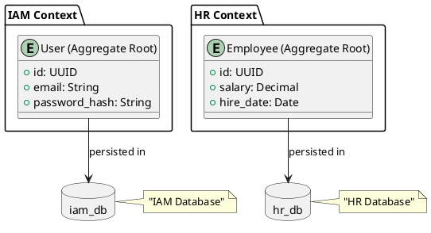

# Data Sovereignty: Database per Bounded Context

Estatus: Accepted

Fecha: 2026-04-13

Decisor: Arquitecto de Software (Tú)

Contexto Técnico: ERP Core / Módulos IAM y RRHH

---

## Contexto y Problema

En el desarrollo del sistema ERP, se ha identificado la necesidad de implementar una arquitectura que garantice la soberanía de los datos. Actualmente, varios Bounded Contexts comparten una sola base de datos, lo que origina problemas como:

- **Conflictos de modelo**: Diferentes Bounded Contexts requieren esquemas y reglas de datos incompatibles.
- **Escala complejidad**: El crecimiento del sistema se ve limitado por la dependencia de una única base de datos centralizada.
- **Riesgos de exposición**: Un fallo en una parte del sistema puede comprometer todos los datos.

El problema reside en que un soloasticsearch database no puede satisfacer las necesidades específicas y seguras de cada Bounded Context, especialmente cuando se requiere escalabilidad horizontal y autonomía operativa.

---

## Decisión

Implementar un diseño de bases de datos independientes para cada Bounded Context. Cada contexto será responsable de su propia persistencia y administración de datos.

### Decisiones Técnicas

1. **Base de Datos por Bounded Context**:
   - Cada Bounded Context tendrá una base de datos independiente.
   - Ejemplo: `iam_db`, `hr_db`, `orders_db`, etc.

2. **Repositorios y Acceso**:
   - Los repositorios de cada Bounded Context solo trabajarán con su propia base de datos.
   - Eliminar cualquier dependencia transversal a nivel de repositorio.

3. **Consistencia y Sincronización**:
   - La sincronización entre Bounded Contexts se gestionará a través de eventos de dominio o API gateway.
   - Se evita la necesidad de transacciones distribuidas complejas.

---

## Consecuencias

### Positivas ✅

- **Escalabilidad**: Cada Bounded Context puede escalar独立emente según sus requisitos.
- **Soborna**：Los datos de un contexto no están expuestos a las vulnerabilidades de otros contextos.
- **Flexibilidad**: Cada equipo de desarrollo puede evolucionar su modelo de datos sin afectar a otros módulos.
- **Seguridad**: Limita la exposición de datos sensibles a los riesgos de una sola base de datos.

### Negativas ❌

- **Complejidad Operativa**: La gestión de múltiples bases de datos aumenta la complejidad en tareas como backups, monitoring y migraciones.
- **Overhead de Configuración**: Cada Bounded Context requerirá su propia configuración de conexión y manejo de errores.
- **Costo de Infraestructura**: El costo de licencias y recursos de bases de datos aumentará con cada nuevo contexto.

---

## Alternativas Consideradas

1. **Shared Database**:
   - Aunque inicialmente más sencillo, complica la escalabilidad y introduce dependencias inadecuadas entre contextos.
   - Rechazada por problemas de diseño a largo plazo.

2. **Base de Datos Federada**:
   - Mantiene un esquema central pero distribuye datos en tablas específicas.
   - Ofrece cierta flexibilidad pero complica la consistencia y las consultas JOINs complejas.
   - Rechazada por motivos de diseño y seguridad.

3. **Single Database with Eventual Consistency**:
   - Aunque reduce el riesgo de inconsistencias, no resuelve los problemas de exposición y dependencia de modelo.
   - No es viable para garantizar la soberanía de datos.

---

## Diagrama de Arquitectura

---

## Conclusión

La implementación de una base de datos por cada Bounded Context es la mejor opción para garantizar la escalabilidad, seguridad y flexibilidad del sistema ERP. Aunque aumenta la complejidad operativa, los beneficios a largo plazo superan los costos iniciales.
