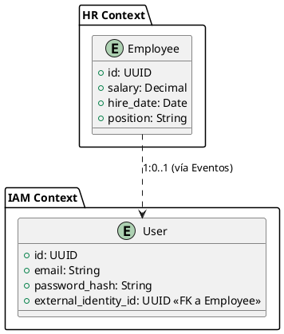

# Separación de Identidad (User) y Dominio Laboral (Employee)

Estatus: Accepted

Fecha: 2026-04-09

Decisor: Arquitecto de Software (Tú)

Contexto Técnico: ERP Core / Módulos IAM y RRHH

## Contexto y Problema

En el desarrollo del ERP, existe una confusión común entre la persona como "sujeto que accede al sistema" y la persona como "recurso laboral de la empresa".

Si unificamos ambas entidades en una sola tabla/modelo:

- El módulo de Identidad (IAM) se acopla a la lógica de negocio de RRHH (nóminas, departamentos).

- Es difícil gestionar usuarios que no son empleados (auditores, bots) o empleados que no tienen acceso al sistema.

- La seguridad se ve comprometida al mezclar credenciales de acceso con datos sensibles de contratos en la misma base de datos.

Decisión

Separar formalmente las entidades en dos Bounded Contexts distintos con persistencia independiente.

1. Definición de Identidad (Contexto IAM)

- Entidad: User

- Persistencia: Base de datos iam_db.

- Responsabilidad: Autenticación, Roles (RBAC), Tokens JWT y MFA.

- Referencia: Contendrá un campo external_id que apunta al EmployeeId (si aplica).

1. Definición de Dominio Laboral (Contexto HR)

- Entidad: Employee

- Persistencia: Base de datos hr_db.

- Responsabilidad: Ciclo de vida laboral (contratos, salarios, vacaciones).

- Referencia: No conoce la existencia de contraseñas ni roles de sistema.

1. Mecanismo de Sincronización

La comunicación se realizará mediante Eventos de Dominio (Coreografía):

- Cuando RRHH crea un Employee, publica EmployeeHired.

- El servicio IAM escucha ese evento y crea un User con permisos por defecto.

Alternativas Consideradas

- Opción 1: Entidad Única (Monolítica): Fácil de implementar al inicio (JOINs simples), pero difícil de escalar y mantener a largo plazo. Rechazada por falta de modularidad.

- Opción 2: Separación Lógica (Shared Database): Usar esquemas diferentes en la misma DB. Es un paso intermedio válido, pero no permite escalado independiente de infraestructura.

Consecuencias
Positivas ✅

- Seguridad (Isolation): Las brechas de seguridad en el perfil del usuario no exponen datos de nómina.

- Escalabilidad: El servicio IAM puede recibir 10,000 peticiones de validación de token sin afectar el rendimiento del módulo de RRHH.

- Flexibilidad: Permite que una persona tenga múltiples cuentas de usuario o que un usuario represente a una entidad no humana.

Negativas ❌

- Complejidad de Datos: No se pueden hacer JOINs SQL entre Usuario y Empleado. La agregación de datos debe hacerse en el API Gateway o mediante proyecciones (CQRS).

- Consistencia Eventual: Hay un pequeño desfase de milisegundos desde que se crea el empleado hasta que el usuario es habilitado.

- Consistencia Eventua: Tendremos que gestionar la consistencia eventual y no podremos realizar JOINs entre dominios a nivel de base de datos (se hará composición en el API Gateway o en el Frontend).

